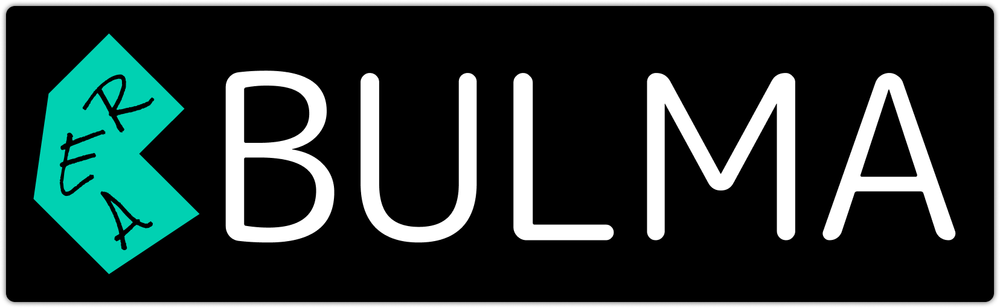

<p align="center">
  
</p>


# Reabulma

Lightweight React wrapper for Bulma, full TypeScript support, no commonjs, no complex extra features, no bunch of dependencies. Just you, bulma and types.


Here is a short list of most important features that `@faramo.zayw/reabulma` has:

- 🚀 Minimum dependencies
- 🔨 Types out of the box
- 🔥 Storybook docs
- 📦 no commonjs, only ES2020

## Supporting IE11 and obsolete platforms

This library uses features like destructuring assignment, `for..of` and `const/let` declarations and doesn't ship with ES5 transpiled sources. If you aim to support browsers like IE11 and below → make sure you run Babel over your `node_modules`

## Storybook

[Demo Link](https://reabulma.vercel.app/)

## Install

Using npm

```sh
npm i @faramo.zayw/reabulma bulma
```

Using yarn

```sh
yarn add @faramo.zayw/reabulma bulma
```

And by adding the following to your index.js:
```js
import 'bulma/css/bulma.css';
```

## Usage

```jsx
import * as React from "react";
import * as ReactDOM from "react-dom";
import { Container, Title } from "@faramo.zayw/reabulma";

ReactDOM.render(
	<Container>
		<Title isSize="4">Hello World!</Title>
	</Container>,
	document.getElementById("root"),
);
```

### FAQ

### `SyntaxError: Unexpected token 'export'`
Try to modify the webpack config in `next.config.js` file to let the babel loader transpile the es6 dependency. You may want to use this package [next-transpile-modules](https://github.com/martpie/next-transpile-modules#readme)

